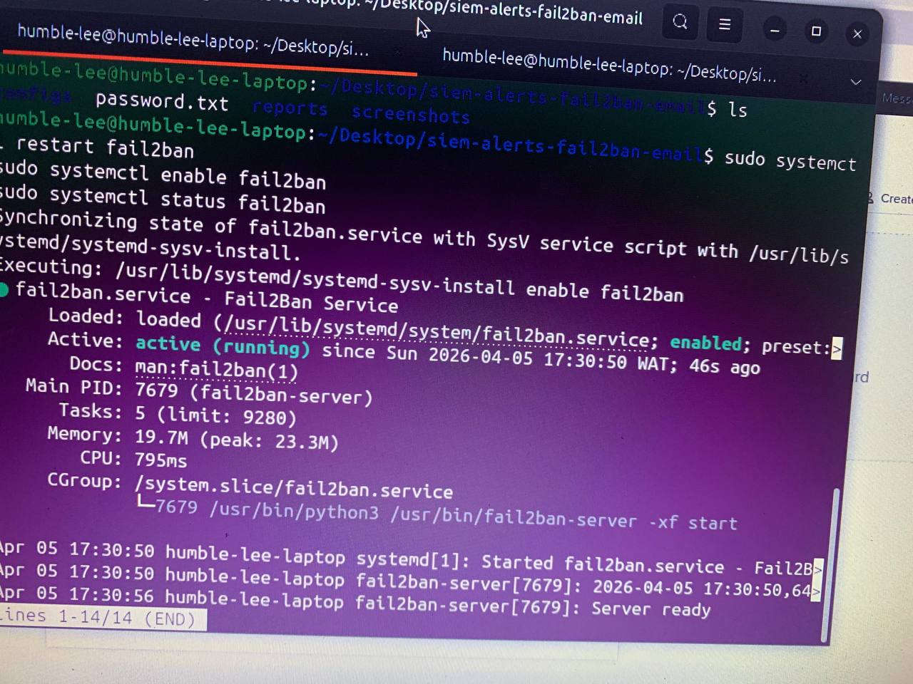
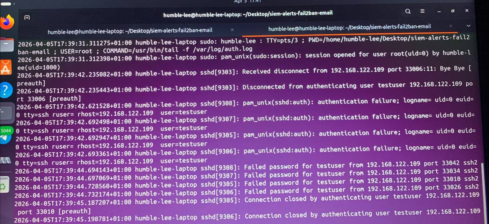
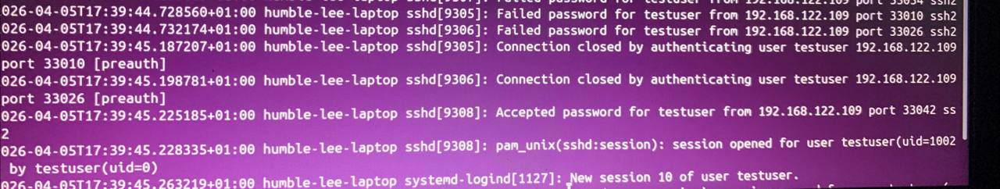
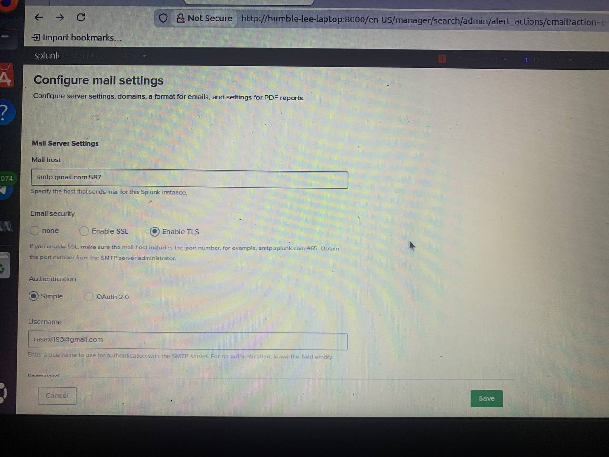
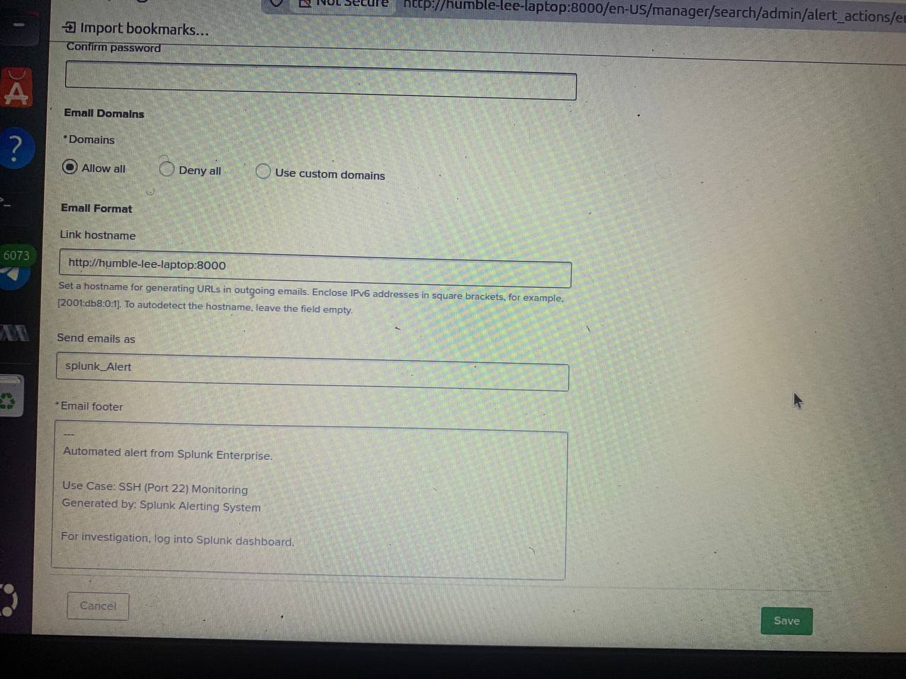
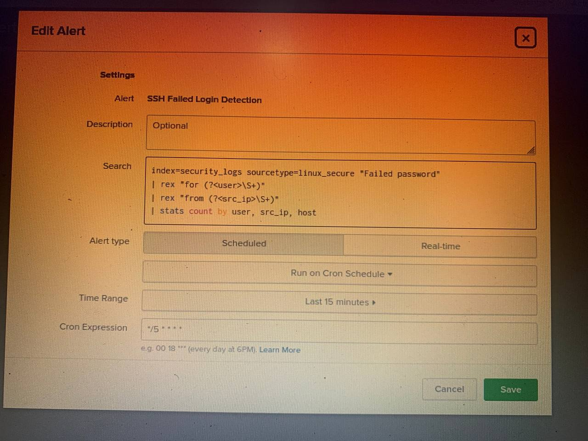
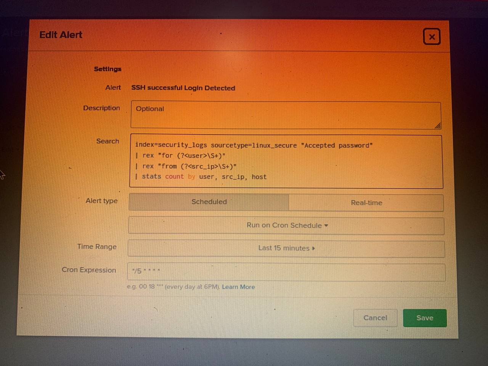
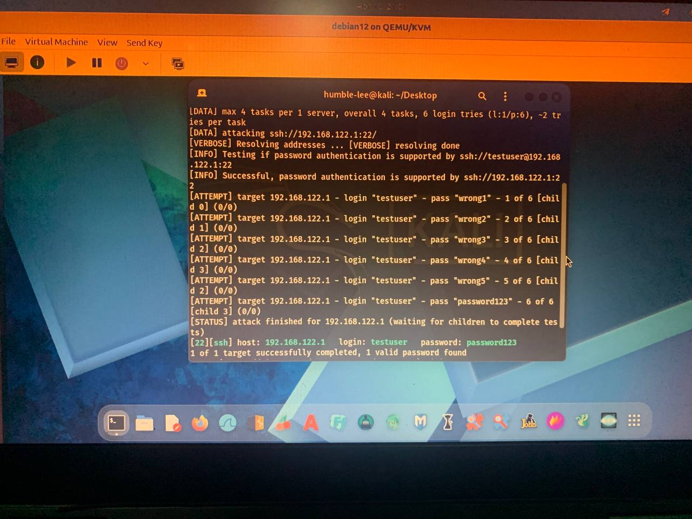

# 🛡️ SIEM Alerts + Fail2ban + Email Alerting Lab

## 📋 Executive Summary

This security automation lab implements a complete detection, prevention, and alerting pipeline for SSH brute force attacks. The solution combines Fail2ban for automated IP blocking, Splunk for SIEM alerting, and email notifications for real-time incident response. A simulated Hydra attack demonstrates the effectiveness of this multi-layered defense strategy.

Key accomplishment: Successfully detected and blocked a brute force attack while sending real-time email alerts, with a critical finding that a successful login occurred before automated blocking—highlighting the need for proactive monitoring.

---

## 🛠️ Technology Stack

| Component | Purpose |
|-----------|---------|
| Fail2ban | Automated IP blocking after failed attempts |
| Splunk Enterprise | SIEM log aggregation and alerting |
| Hydra | Brute force attack simulation |
| Kali Linux | Attacker VM (192.168.122.109) |
| Ubuntu 22.04 | Target host (192.168.122.1) |
| SMTP/Gmail | Email alert delivery |

---

## 📊 Attack Simulation Results

| Attempt | Result | Source IP |
|---------|--------|-----------|
| 1-5 | ❌ Authentication Failed | 192.168.122.109 |
| 6 | ✅ Authentication Successful | 192.168.122.109 |

Critical Finding: The 6th attempt (successful) occurred BEFORE Fail2ban blocked the IP, demonstrating a race condition where an attacker could gain access before automated prevention triggers.

---

## 📸 Lab Implementation & Results

### 1. Fail2ban Service Verification



*Fail2ban service running successfully on Ubuntu target with SSH jail enabled.*

---

### 2. Failed Authentication Attempts



*Five consecutive failed SSH login attempts from Kali VM (192.168.122.109) attempting to brute force the testuser account.*

---

### 3. Successful Authentication After Brute Force



*The 6th attempt successfully authenticated using the correct password "Password123!" — demonstrating credential compromise.*

---

### 4. Fail2ban IP Blocking


*Fail2ban detecting the attack pattern and issuing a 3600-second ban on the offending IP address.*

---

### 5. Fail2ban Status Report


*Verification of active ban showing 192.168.122.109 in the banned IP list.*

---

### 6. Splunk Email Alert Configuration (Failed Logins)



*Splunk alert configuration for high failure rate detection with email notification setup.*

---

### 7. Splunk Failed Login Alert Configuration



*Detailed alert configuration for detecting multiple failed SSH attempts with custom threshold of 4 failures.*

---

### 8. Splunk Success-After-Failure Alert Configuration



*Advanced alert configuration detecting potentially compromised credentials by identifying successful logins within 5 minutes of multiple failures.*

---

### 9. Email Alert Received - Failed Login Alert


*Real-time email notification received when the high failure rate threshold was exceeded.*

---

### 10. Email Alert Received - Success After Failure Alert


*Critical severity email alert indicating possible credential compromise — success after multiple failures.*

---
### Kali/Hydra Attack Failed and Successful Attempts


------------------
## 🚨 Splunk Alerts Deployed

| Alert Name | Trigger Condition | Email Severity | Purpose |
|------------|-------------------|----------------|---------|
| SSH Failed Login| >4 failures in 5 minutes | ⚠️ HIGH | Detect brute force attempts || Success After Failure | Success within 5 min of failures | 🔴 CRITICAL | Identify compromised credentials |
| SSH Successful Login | >0 after multiple failure | 🔴CRITICAL| Identify compromised credentials |

---

## 📈 MITRE ATT&CK Framework Mapping

| Tactic | Technique | ID | Detection Method | Coverage |
|--------|-----------|-----|------------------|----------|
| Credential Access | Brute Force | T1110 | Splunk alert + Fail2ban | ✅ Full |
| Credential Access | Password Guessing | T1110.001 | Hydra detection + Email alert | ✅ Full |
| Defense Evasion | Modify Authentication Process | T1556 | Not implemented | ❌ Gap |
| Discovery | Account Discovery | T1087 | Invalid user detection | ✅ Full |
| Persistence | Create Account | T1136 | Not implemented | ❌ Gap |
| Lateral Movement | Remote Services (SSH) | T1021 | SSH login monitoring | ✅ Full |

### MITRE ATT&CK Detection Coverage

| Technique | ID | Coverage | Status |
|-----------|-----|----------|--------|
| Brute Force | T1110 | ████████████████████ 100% | ✅ Detected |
| Password Guessing | T1110.001 | ████████████████████ 100% | ✅ Detected |
| Account Discovery | T1087 | ████████████████████ 100% | ✅ Detected |
| Remote Services | T1021 | ████████████████████ 100% | ✅ Detected |
| Modify Auth Process | T1556 | ░░░░░░░░░░░░░░░░░░░░ 0% | ❌ Gap |
| Create Account | T1136 | ░░░░░░░░░░░░░░░░░░░░ 0% | ❌ Gap |

Overall Detection Rate: 67% (4 of 6 techniques)
---

## ⚠️ Critical Security Finding

> Race Condition Identified: The 6th attempt (successful login) occurred BEFORE Fail2ban blocked the IP address.

Root Cause: Fail2ban counts failures but only issues a ban AFTER the threshold is reached. An attacker guessing the correct password on the final attempt can gain access before the ban is applied.

Impact: Up to 1-2 second window where attacker can establish a session before blocking.

Mitigation Strategy:
- Reduce maxretry from 5 to 3
- Implement rate limiting on SSH connections
- Require MFA even for successful password authentication
- Alert on "success after failure" patterns (implemented ✅)

---

## 🔧 Security Recommendations

| Priority | Recommendation | Implementation | Impact |
|----------|----------------|----------------|--------|
| 🔴 HIGH | Reduce Fail2ban maxretry to 3 | maxretry = 3 | Blocks 60% faster |
| 🔴 HIGH | Enable MFA for SSH | Google Authenticator + PAM | Eliminates race condition |
| 🟠 MEDIUM | Decrease findtime to 300 seconds | findtime = 300 | Faster attack detection |
| 🟡 LOW | Implement permanent ban for repeat offenders | recidive jail | Long-term threat blocking |
| 🟡 LOW | Integrate with SOAR for automated response | TheHive/Cortex | Full automation |

### Recommended Fail2ban Configuration
## 📊 Recommended Fail2ban Configuration

```ini
[DEFAULT]
bantime = 7200
findtime = 300
maxretry = 3

[sshd]
enabled = true
port = ssh
filter = sshd
logpath = /var/log/auth.log
maxretry = 3
bantime = 7200
findtime = 300

[recidive]
enabled = true
logpath = /var/log/fail2ban.log
banaction = iptables-allports
bantime = 86400
findtime = 86400
maxretry = 3
```
------
```
📁 Project Structure.
siem-alerts-fail2ban-email/
│
├── README.md # Project documentation
├── password.txt # Hydra password list (5 wrong + 1 correct)
│
├── screenshots/
│ ├── 01-fail2ban-active.jpg
│ ├── 02-failed-attempts.jpg
│ ├── 03-successful-login.jpg
│ ├── 04-fail2ban-ban.jpg
│ ├── 05-fail2ban-status.jpg
│ ├── 06-splunk-email-alert-config.jpg
│ ├── 08-splunk-failed-login-alert-config.jpg
│ ├── 09-splunk-success-after-failure-alert-config.jpg
│ ├── 10-splunk-failed-alert-received.jpg
│ ├── 11-splunk-success-after-failure-alert-received.jpg
│ └── 12-kali-hydra-attack.jpg
│
├── reports/
│ └── incident-report.md # Full incident investigation report
│
└── configs/
└── jail.local # Fail2ban configuration
 ```   
--------------------
## 📚 Skills Demonstrated

| Skill Category | Specific Competencies |
|----------------|----------------------|
| Security Automation | Fail2ban configuration, automated IP blocking |
| SIEM Engineering | Splunk alert creation, email integration |
| Detection Engineering | Success-after-failure detection logic |
| Threat Analysis | MITRE ATT&CK mapping, race condition identification |
| Incident Response | Real-time alerting, compromise detection |
| Technical Documentation | Professional README, incident report writing |

----------------------
🔗 Related Portfolio Projects
Splunk SSH Brute Force Detection (https://github.com/humble-lee1/splunk-ssh-brute-force-detection) - SIEM dashboard foundation
Phishing Email Analysis Lab (https://github.com/humble-lee1/phishing-email-analysis-lab) - Incident response methodology

📅 Lab Completion Date
April 2026
