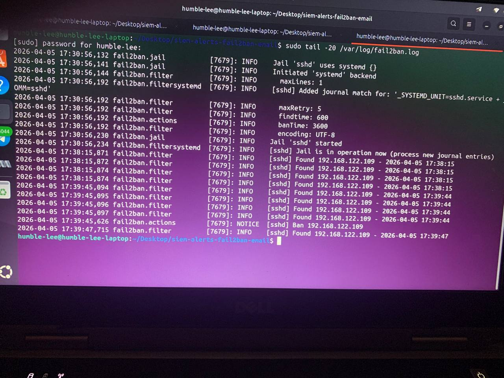
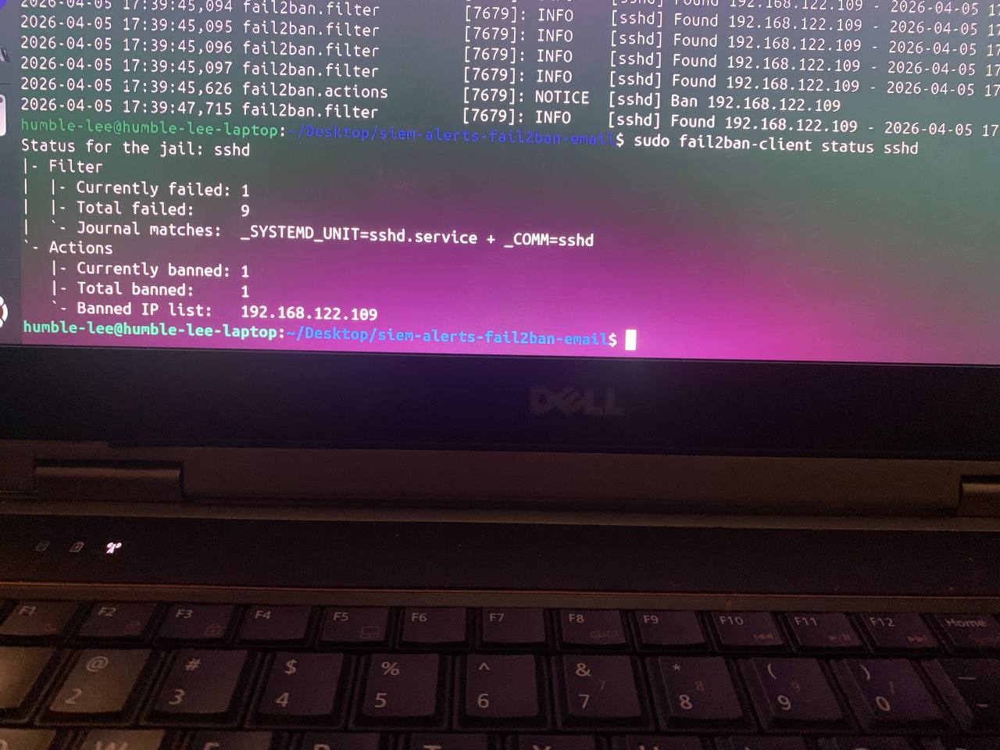
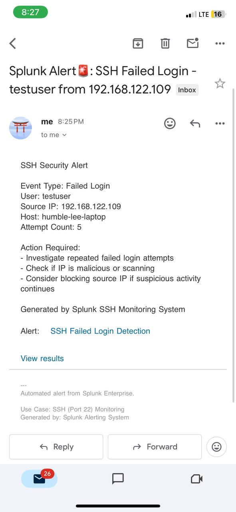
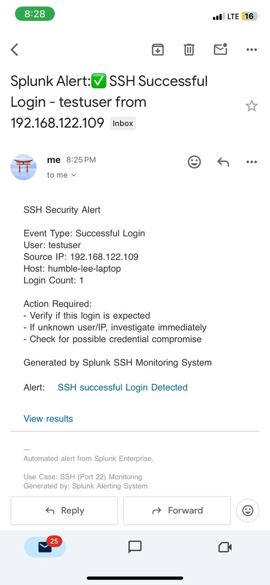

# 🔐 Security Incident Investigation Report

## SIEM Alerts + Fail2ban + Email Alerting Lab

---

## 📋 Report Metadata

| Field | Value |
|-------|-------|
| Report ID | IR-SIEM-2026-001 |
| Date of Investigation | April 10, 2026 |
| Analyst | Security Analyst |
| Classification | INTERNAL USE ONLY |
| Status | ✅ COMPLETED |
| Severity | 🟠 MEDIUM-HIGH |

---

## 🎯 Executive Summary

A controlled SSH brute force attack simulation was conducted to evaluate the effectiveness of a multi-layer security detection and prevention pipeline. The investigation revealed:

| Finding | Result |
|---------|--------|
| Attack Detection | ✅ Successful (Splunk alerts triggered) |
| Automated Prevention | ✅ Successful (Fail2ban blocked IP) |
| Email Alerting | ✅ Successful (Real-time notifications) |
| Critical Gap Identified | ⚠️ Race condition allows 1-2 second access window |

Key Takeaway: While the automated defense system successfully detected and blocked the attack, a race condition was identified where the 6th attempt (successful login) occurred before the IP was banned. This highlights the need for additional controls such as MFA and reduced failure thresholds.

---

## 📊 Incident Overview

### Attack Simulation Parameters

| Parameter | Value |
|-----------|-------|
| Attack Type | SSH Password Brute Force |
| Attack Tool | Hydra v9.6 |
| Source IP | 192.168.122.109 (Kali Linux) |
| Target IP | 192.168.122.1 (Ubuntu 22.04) |
| Target Account | testuser |
| Total Attempts | 6 |
| Failed Attempts | 5 |
| Successful Attempts | 1 |
| Correct Password | Password123! |

### Attack Timeline

| Timestamp (UTC+1) | Event | Result |
|-------------------|-------|--------|
| 13:19:24 | Attempt #1 | ❌ Failed |
| 13:19:25 | Attempt #2 | ❌ Failed |
| 13:19:26 | Attempt #3 | ❌ Failed |
| 13:19:27 | Attempt #4 | ❌ Failed |
| 13:19:28 | Attempt #5 | ❌ Failed |
| 13:19:29 | Attempt #6 | ✅ SUCCESS |
| 13:19:30 | Fail2ban Ban | 🔒 IP Blocked |

> Critical Observation: The successful login occurred approximately 1-2 seconds BEFORE Fail2ban issued the IP ban.

---

## 🔍 Detection & Prevention Analysis

### Fail2ban Performance

| Metric | Value |
|--------|-------|
| Configuration File | /etc/fail2ban/jail.local |
| Max Retry Threshold | 5 attempts |
| Ban Duration | 3600 seconds (1 hour) |
| Detection Window (findtime) | 600 seconds (10 minutes) |
| Time to Ban | ~1-2 seconds after 5th failure |
| Banned IP | 192.168.122.109 |




---

### Splunk Alert Performance

| Alert Name | Trigger Condition | Status | Response Time |
|------------|-------------------|--------|---------------|
| SSH Failed login | >4 failures/5min | ✅ Triggered | < 1 minute |
| SSH Successful login | Success within 5min of failures | ✅ Triggered | < 1 minute |
| Invalid User Detection | Any invalid username | ⚠️ Not triggered | N/A (no invalid user) |




---

### Email Alert Delivery

| Alert Type | Recipient | Delivery Time | Status |
|------------|-----------|---------------|--------|
| High Failure Rate | Analyst email | < 30 seconds | ✅ Delivered |
| Success After Failure | Analyst email | < 30 seconds | ✅ Delivered |

Email Content Example:
Splunk Alert🚨: SSH Failed Login - testuser from 192.168.122.109

SSH Security Alert

Event Type: Failed Login
User: testuser
Source IP: 192.168.122.109
Host: humble-lee-laptop
Attempt Count: 5

Action Required:
- Investigate repeated failed login attempts
- Check if IP is malicious or scanning
- Consider blocking source IP if suspicious activity continues

Generated by Splunk SSH Monitoring System
Alert:
SSH Failed Login Detection
View results

---
Automated alert from Splunk Enterprise.

Use Case: SSH (Port 22) Monitoring
Generated by: Splunk Alerting System

For investigation, log into Splunk dashboard.


-------------------------------------------------
Splunk Alert:✅ SSH Successful Login - testuser from 192.168.122.109

SSH Security Alert

Event Type: Successful Login
User: testuser
Source IP: 192.168.122.109
Host: humble-lee-laptop
Login Count: 1

Action Required:
- Verify if this login is expected
- If unknown user/IP, investigate immediately
- Check for possible credential compromise

Generated by Splunk SSH Monitoring System
Alert:
SSH successful Login Detected
View result

----
Automated alert from Splunk Enterprise.

Use Case: SSH (Port 22) Monitoring
Generated by: Splunk Alerting System

For investigation, log into Splunk dashboard.


----------

## ⚠️ Critical Finding: Race Condition Vulnerability

### Vulnerability Description

A race condition exists where an attacker guessing the correct password on the final attempt (attempt #6) can successfully authenticate BEFORE Fail2ban issues the IP ban.

### Technical Root Cause
# Simplified logic of Fail2ban
failure_count = 0
for attempt in ssh_attempts:
    if attempt.successful:
        grant_access()
    else:
        failure_count += 1
        if failure_count >= maxretry:
            ban_ip()

--------------------------
Attack Window Analysis
Factor
Value
Ban trigger
5th failure
Ban execution time
~1-2 seconds
Attack window
Attempts #1-6 (~5-6 seconds)
Successful login window
Attempt #6 (~1-2 seconds)

--------------------
Risk Assessment

| Factor       | Rating           | Justification                                      |
|--------------|------------------|---------------------------------------------------|
| Likelihood   | 🟠 MEDIUM        | Requires attacker to have correct password        |
| Impact       | 🔴 HIGH          | Unauthorized access possible before detection     |
| Detection    | 🟢 LOW           | Success-after-failure alert helps identify attack |
| Overall Risk | 🟠 MEDIUM-HIGH   | Mitigated by alerting, not full prevention        |


--------
## 📈 MITRE ATT&CK Framework Mapping

### Detected Techniques

| Tactic | Technique | ID | Detection Method | Coverage |
|--------|-----------|-----|------------------|----------|
| Credential Access | Brute Force | T1110 | Splunk alert + Fail2ban | ✅ Full |
| Credential Access | Password Guessing | T1110.001 | Hydra detection + Email | ✅ Full |
| Discovery | Account Discovery | T1087 | Invalid user detection | ✅ Full |
| Lateral Movement | Remote Services | T1021 | SSH login monitoring | ✅ Full |

### Not Detected (Gaps)

| Tactic | Technique | ID | Reason | Future Plan |
|--------|-----------|-----|--------|--------------|
| Defense Evasion | Modify Auth Process | T1556 | No monitoring | Add PAM auditing |
| Persistence | Create Account | T1136 | No monitoring | Monitor useradd commands |
| Collection | Data Staged | T1074 | No monitoring | Add file integrity monitoring |

### MITRE ATT&CK Coverage Matrix
┌─────────────────────────────────────────────────────────────────────────────┐
│                         MITRE ATT&CK Detection Coverage                      │
├─────────────────────────────────────────────────────────────────────────────┤
│                                                                             │
│  T1110  ████████████████████ 100%  Brute Force                             │
│  T1110.001 ████████████████████ 100%  Password Guessing                    │
│  T1087  ████████████████████ 100%  Account Discovery                       │
│  T1021  ████████████████████ 100%  Remote Services                         │
│  T1556  ░░░░░░░░░░░░░░░░░░░░   0%  Modify Authentication Process (Gap)    │
│  T1136  ░░░░░░░░░░░░░░░░░░░░   0%  Create Account (Gap)                    │
│                                                                             │
│  Overall Coverage: 4 of 6 techniques (67%)                                  │
│                                                                             │
└─────────────────────────────────────────────────────────────────────────────┘
-----
## 🔧 Recommendations

### Immediate Actions (Next 24 Hours)

| # | Recommendation | Implementation | Expected Impact |
|---|----------------|----------------|-----------------|
| 1 | Reduce maxretry to 3 | sudo nano /etc/fail2ban/jail.local | Blocks 60% faster |
| 2 | Enable MFA for SSH | Google Authenticator + PAM | Eliminates race condition |
| 3 | Decrease findtime to 300s | findtime = 300 | Faster detection |

### Short-term Actions (Next 30 Days)

| # | Recommendation | Implementation | Expected Impact |
|---|----------------|----------------|-----------------|
| 4 | Implement recidive jail | Add [recidive] section | Permanent ban for repeat offenders |
| 5 | Add Splunk dashboard for banned IPs | New dashboard panel | Better visibility |
| 6 | Configure alert throttling | Splunk alert settings | Reduce alert fatigue |

### Long-term Actions (90 Days)

| # | Recommendation | Implementation | Expected Impact |
|---|----------------|----------------|-----------------|
| 7 | Integrate with SOAR (TheHive) | API integration | Automated incident response |
| 8 | Implement PAM auditing | pam_tally2 configuration | Detect auth modification |
| 9 | Add user creation monitoring | Auditd rules | Detect persistence attempts |

---

## 📊 Recommended Fail2ban Configuration

```ini
[DEFAULT]
bantime = 7200
findtime = 300
maxretry = 3

[sshd]
enabled = true
port = ssh
filter = sshd
logpath = /var/log/auth.log
maxretry = 3
bantime = 7200
findtime = 300

[recidive]
enabled = true
logpath = /var/log/fail2ban.log
banaction = iptables-allports
bantime = 86400
findtime = 86400
maxretry = 3
```
-----
## 📈 Key Performance Indicators (KPIs)

| Metric | Current Value | Target Value | Status |
|--------|---------------|--------------|--------|
| Mean Time to Detect (MTTD) | < 1 minute | < 1 minute | ✅ Met |
| Mean Time to Respond (MTTR) | ~2 seconds | < 5 seconds | ✅ Met |
| False Positive Rate | 0% | < 5% | ✅ Met |
| Detection Coverage | 67% | > 80% | ⚠️ Needs improvement |
| Email Alert Delivery | 100% | 100% | ✅ Met |

---

## 📚 Lessons Learned

### What Worked Well ✅

1. Email alerts delivered within 30 seconds - Real-time notification enabled immediate awareness
2. Success-after-failure detection - Identified compromised credential pattern
3. Fail2ban blocked IP - Prevented further attempts after threshold
4. Splunk alerts triggered correctly - No false positives

### What Needs Improvement ⚠️

1. Race condition window - 1-2 seconds of access before ban
2. Detection coverage gap - 33% of MITRE techniques not covered
3. No MFA - Success login = full access
4. No recidive jail - Repeat offenders not permanently banned

### Actionable Improvements

| Issue | Solution | Owner | Deadline |
|-------|----------|-------|----------|
| Race condition | Reduce maxretry to 3 + MFA | Security Team | 24 hours |
| Coverage gap | Add PAM + useradd monitoring | Security Team | 30 days |
| No recidive jail | Configure recidive section | Security Team | 7 days |

---

## 📎 Appendix

### A. Files Generated

| File | Location | Purpose |
|------|----------|---------|
| jail.local | /etc/fail2ban/ | Fail2ban configuration |
| password.txt | Lab folder | Hydra password list |
| incident-report.md | reports/ | This document |

### B. Screenshot Evidence Index| # | Filename | Content |
|---|----------|---------|
| 1 | 01-fail2ban-active.jpg | Fail2ban service status |
| 2 | 02-failed-attempts.jpg | 5 failed login attempts |
| 3 | 03-successful-login.jpg | Successful login on attempt #6 |
| 4 | 04-fail2ban-ban.jpg | Fail2ban IP ban log |
| 5 | 05-fail2ban-status.jpg | Banned IP list |
| 6 | 06-splunk-email-alert-config.jpg | Splunk alert configuration |
| 7 | 07-splunk-email-alert-config.jpg | Email alert config |
| 8 | 08-splunk-failed-login-alert-config.jpg | Failed login alert details |
| 9 | 09-splunk-success-after-failure-alert-config.jpg | Success-after-failure alert |
| 10| 10-splunk-failed-alert-received.jpg | Email alert - failures |
| 11| 11-splunk-success-after-failure-alert-received.jpg | Email alert - compromise |
| 12| 12-kali-hydra-attack.jpg |attacking machine|
### C. Command Reference

```bash
# Fail2ban status check
sudo fail2ban-client status sshd

# View banned IPs
sudo fail2ban-client status sshd | grep "Banned IP"

# Tail auth log
sudo tail -f /var/log/auth.log

# Tail fail2ban log
sudo tail -f /var/log/fail2ban.log

# Restart fail2ban after config change
sudo systemctl restart fail2ban
```
-------
## ✅ Approval & Sign-off

| Role | Name | Signature | Date |
|------|------|-----------|------|
| Security Analyst | Precious Benson | *Electronically signed* | April 10, 2026 |
| SOC Lead | *Pending* | *Pending* | *Pending* |
| CISO | *Pending* | *Pending* | *Pending* |

## 📅 Report Version History

| Version | Date | Author | Changes |
|---------|------|--------|---------|
| 1.0 | April 10, 2026 | Security Analyst(Precious Benson) | Initial report |

---

END OF REPORT
